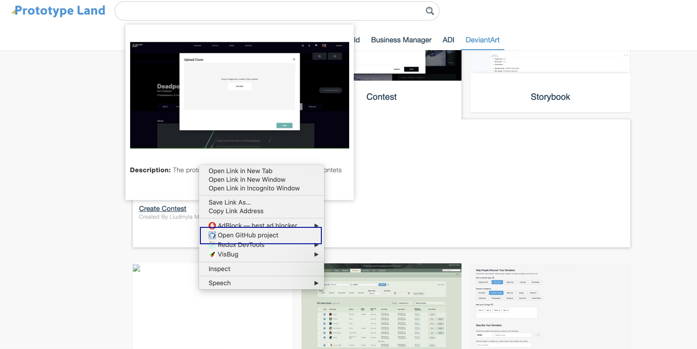

# Github repo linke
Github repo link is a Chrome Extension used only for Prototype lend site. It adds one more menu item to the Context menu. Click on it opens a new tab with the current Github repository.

